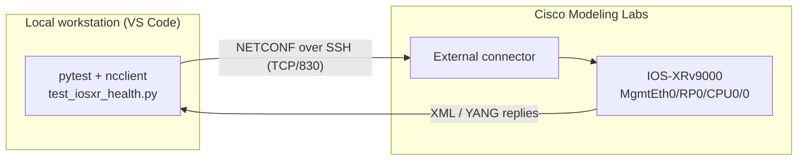

# AI-Driven IOS-XR Manageability & Health Validation Suite

A compact, production-style **Python + pytest** test suite that validates the
**manageability surface** and **live operational health** of a Cisco
**IOS-XRv9000** router over **NETCONF-YANG** (RFC 6241), running against a
Cisco Modeling Labs (CML) topology.

> **Proof-of-work project.** Built to demonstrate hands-on Python test
> automation and NETCONF-YANG manageability skills, and to show how GenAI tools
> accelerate real test development.

---

## Why this project maps to the role

The target role is optical system test (DWDM / ROADM / OTN on NCS1010, NCS1004,
NCS1014). Those optical platforms and the high-end routers all run the **same
network OS: IOS-XR**, and they are all managed through the **same manageability
stack: NETCONF / YANG (plus RESTCONF, gNMI/Telemetry)**.

So the workflow proven here transfers directly to the optical box:

| Skill in the JD | How this project demonstrates it |
| --- | --- |
| Python Automation | Full `pytest` suite: fixtures, markers, assertions, HTML reporting |
| NETCONF-YANG (manageability) | Session setup, capability discovery, config + operational `<get>` |
| GenAI / GitHub Copilot | Used to scaffold fixtures, connection params and XML-parsing logic |
| Grey-box / on-the-box testing | Validates live operational YANG state, not just CLI output |
| Test engineering methodology | Clear test design, traceable assertions, repeatable reporting |

---

## Architecture



---

## Technology stack

- **Language:** Python 3.8
- **Test framework:** pytest, pytest-html
- **NETCONF client:** ncclient (over SSH, TCP/830)
- **XML handling:** xmltodict
- **Device under test:** Cisco IOS-XRv9000 on Cisco Modeling Labs (CML)

---

## Test coverage

| # | Test | Category | What it proves |
| - | --- | --- | --- |
| 1 | `test_netconf_connection_established` | connectivity | NETCONF session opens and a session-id is assigned |
| 2 | `test_netconf_capabilities_advertised` | manageability | Device advertises NETCONF base + a healthy set of YANG models |
| 3 | `test_running_config_contains_mgmt_interface` | config | `<running>` datastore contains `MgmtEth0/RP0/CPU0/0` |
| 4 | `test_get_system_uptime_and_hostname` | operational | Live `<get>` + subtree filter returns hostname & uptime (parsed with xmltodict) |
| 5 | `test_management_interface_is_operationally_up` | operational | Management interface is operationally **up** (grey-box state check) |

---

## GenAI utilization

Leveraged **GitHub Copilot / ChatGPT** to rapidly generate the pytest fixtures,
NETCONF connection parameters and XML-parsing logic, then reviewed, corrected
and hardened the output (environment-variable credentials, clean teardown,
robust assertions) - accelerating test development while keeping engineering
ownership of correctness. This mirrors the JD's emphasis on using Copilot/GenAI
to speed up test development, refactoring and documentation.

---

## Repository structure

```
iosxr-qa-demo/
├── test_iosxr_health.py   # the NETCONF-YANG test suite
├── pytest.ini             # pytest config: markers, HTML report, live logs
├── requirements.txt       # pinned dependencies (reproducible env)
├── qa_report.html         # generated HTML test report (artifact)
├── .gitignore
└── README.md
```

---

## Prerequisites

### 1. Enable NETCONF-YANG on the router (one time)

In **exec** mode, generate the SSH crypto keys:

```
crypto key generate rsa
```
*(accept the default 2048-bit modulus)*

Then in **config** mode:

```
configure
ssh server v2
ssh server vrf default
ssh server netconf vrf default
netconf-yang agent ssh
commit
end
```

Verify on the router:

```
show ssh
show netconf-yang statistics
```

### 2. Reachability

Confirm the management IP is reachable from your workstation on TCP/830
(see *How to run*, step 1).

---

## How to run

```powershell
# 1. Confirm the router's NETCONF port is reachable
Test-NetConnection -ComputerName 192.168.255.40 -Port 830

# 2. Create and activate the virtual environment
python -m venv venv
venv\Scripts\activate            # Windows
# source venv/bin/activate       # macOS / Linux

# 3. Install dependencies
pip install -r requirements.txt

# 4. Provide connection details (defaults target the lab; override as needed)
$env:XR_HOST="192.168.255.40"
$env:XR_USERNAME="cisco"
$env:XR_PASSWORD="<your-password>"

# 5. Run the suite and generate the HTML report
pytest test_iosxr_health.py --html=qa_report.html --self-contained-html
```

Open `qa_report.html` in a browser to review the results.

Connection settings are read from environment variables
(`XR_HOST`, `XR_PORT`, `XR_USERNAME`, `XR_PASSWORD`, `XR_TIMEOUT`) so no real
credentials are ever committed to source control.

---

## What I learned / next steps

- Establishing NETCONF sessions and reading YANG operational state with ncclient.
- Mapping IOS-XR YANG models (`Cisco-IOS-XR-shellutil-oper`,
  `Cisco-IOS-XR-pfi-im-cmd-oper`) to concrete health assertions.
- **Next:** add RESTCONF and gNMI/streaming-telemetry checks, and extend the
  operational assertions toward optical-layer models (L0/L1) to align with the
  NCS optical platforms.
