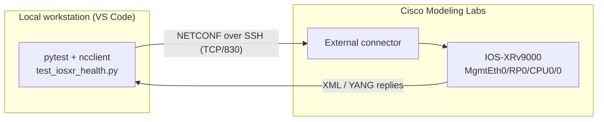

# AI-Driven IOS-XR Manageability & Health Validation Suite

A compact, production-style **Python + pytest** test suite that validates the
**manageability surface** and **live operational health** of a Cisco
**IOS-XRv9000** router over **NETCONF-YANG** (RFC 6241), running against a
Cisco Modeling Labs (CML) topology.

> **Proof-of-work project.** Built to demonstrate hands-on Python test
> automation and NETCONF-YANG manageability skills, and to show how GenAI tools
> accelerate real test development.

---

## Why this project maps to the role

The target role is optical system test (DWDM / ROADM / OTN on NCS1010, NCS1004,
NCS1014). Those optical platforms and the high-end routers all run the **same
network OS: IOS-XR**, and they are all managed through the **same manageability
stack: NETCONF / YANG (plus RESTCONF, gNMI/Telemetry)**.

So the workflow proven here transfers directly to the optical box:

| Skill in the JD | How this project demonstrates it |
| --- | --- |
| Python Automation | Full `pytest` suite: fixtures, markers, assertions, HTML reporting |
| NETCONF-YANG (manageability) | Session setup, capability discovery, config + operational `<get>` |
| GenAI / GitHub Copilot | Used to scaffold fixtures, connection params and XML-parsing logic |
| Grey-box / on-the-box testing | Validates live operational YANG state, not just CLI output |
| Test engineering methodology | Clear test design, traceable assertions, repeatable reporting |

---

## Architecture



---

## Technology stack

- **Language:** Python 3.8
- **Test framework:** pytest, pytest-html
- **NETCONF client:** ncclient (over SSH, TCP/830)
- **XML handling:** xmltodict
- **Device under test:** Cisco IOS-XRv9000 on Cisco Modeling Labs (CML)

---

## Test coverage

Tests are organised by concern under `tests/`, sharing one NETCONF session (and
an optional RESTCONF client) from `conftest.py`:

| Module | Markers | What it validates |
| --- | --- | --- |
| `tests/test_connectivity.py` | connectivity, manageability | NETCONF session establishes; device advertises a healthy YANG capability surface |
| `tests/test_operational.py` | operational | Live uptime & hostname; management interface is up; interface inventory is reported |
| `tests/test_configuration.py` | config | Running-config validation; required-config compliance (parametrized); `<edit-config>` loopback create/verify/delete round-trip; direct write to `<running>` rejected (negative); `discard-changes` rollback |
| `tests/test_openconfig.py` | openconfig | OpenConfig models are advertised and `openconfig-interfaces` returns data |
| `tests/test_restconf.py` | restconf | YANG library and interfaces over RESTCONF/HTTPS (auto-skipped if the RESTCONF agent is not enabled) |

---

## Test results

Run the whole suite with `pytest`. Against a live **IOS-XRv9000** in Cisco
Modeling Labs, the NETCONF, OpenConfig and configuration tests pass; the RESTCONF
tests **skip automatically** if the image does not expose a RESTCONF agent, so
the suite stays green rather than failing on unsupported platforms.

Each run emits a self-contained **`qa_report.html`** (configured in `pytest.ini`)
with per-test results and the captured live logs (hostname, uptime, interface
state).

---

---

## GenAI utilization

Leveraged **GitHub Copilot / ChatGPT** to rapidly generate the pytest fixtures,
NETCONF connection parameters and XML-parsing logic, then reviewed, corrected
and hardened the output (environment-variable credentials, clean teardown,
robust assertions) - accelerating test development while keeping engineering
ownership of correctness. This mirrors the JD's emphasis on using Copilot/GenAI
to speed up test development, refactoring and documentation.

---

## Repository structure

```
iosxr-qa-demo/
├── config.py              # connection settings (env-var driven)
├── conftest.py            # shared fixtures: NETCONF session + RESTCONF client
├── tests/
│   ├── test_connectivity.py    # NETCONF session + YANG capabilities
│   ├── test_operational.py     # live operational-state (YANG oper models)
│   ├── test_configuration.py   # config validation + edit-config automation
│   ├── test_openconfig.py      # OpenConfig support
│   └── test_restconf.py        # RESTCONF over HTTPS (skips if not enabled)
├── pytest.ini             # markers, HTML report, live logs, test paths
├── requirements.txt       # pinned dependencies (reproducible env)
├── qa_report.html         # generated on each run (git-ignored)
├── .gitignore
└── README.md
```

---

## Prerequisites

### 1. Enable NETCONF-YANG on the router (one time)

In **exec** mode, generate the SSH crypto keys:

```
crypto key generate rsa
```
*(accept the default 2048-bit modulus)*

Then in **config** mode:

```
configure
ssh server v2
ssh server vrf default
ssh server netconf vrf default
netconf-yang agent ssh
commit
end
```

Verify on the router:

```
show ssh
show netconf-yang statistics
```

### 2. Reachability

Confirm the management IP is reachable from your workstation on TCP/830
(see *How to run*, step 1).

---

## How to run

```bash
# 1. Create and activate a virtual environment
python -m venv venv
source venv/bin/activate          # Linux / macOS
# venv\Scripts\activate           # Windows

# 2. Install dependencies
pip install -r requirements.txt

# 3. Provide connection details (defaults target the lab; override as needed)
export XR_HOST=192.168.255.124
export XR_USERNAME=cisco
export XR_PASSWORD='your-password'

# 4. Run the whole suite (auto-generates qa_report.html)
pytest
```

Connection settings are read from environment variables
(`XR_HOST`, `XR_PORT`, `XR_RESTCONF_PORT`, `XR_USERNAME`, `XR_PASSWORD`,
`XR_TIMEOUT`) so no real credentials are ever committed to source control. The
RESTCONF tests skip automatically unless the router exposes a RESTCONF agent.

Open `qa_report.html` in a browser to review the results.

---

## What I learned / next steps

- Establishing NETCONF sessions and reading YANG operational state with ncclient.
- Mapping IOS-XR YANG models (`Cisco-IOS-XR-shellutil-oper`,
  `Cisco-IOS-XR-pfi-im-cmd-oper`) to concrete health assertions.
- **Next:** add gNMI / streaming-telemetry validation and lightweight AI/ML
  anomaly detection on operational metrics, and extend the assertions toward
  optical-layer YANG models (L0/L1) to align with the NCS optical platforms.
